# ImageClassfication

This is the SOP to create an image classfication model and coverted to an OpenVINO compatibile format and can be inference with CPU, GPU (UMA, HD graphic), or NCS series  
Below is the step by step I did on Maldives Swift 7 with the local environment and file location consistent.  
To avoid file access authorization conflict, please "Run as administrator" with the "Command Prompt" in this document
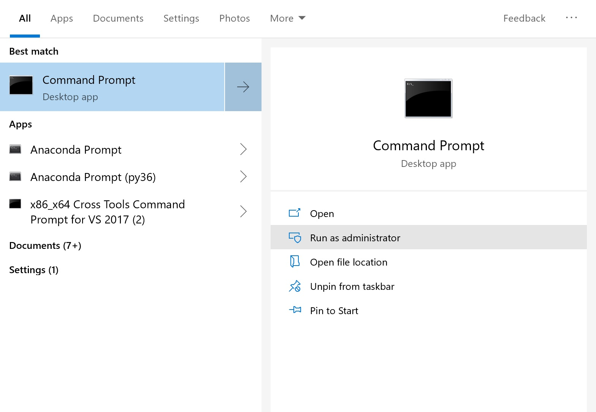  

## Create virtual environment
Before you create virtual environment, python should be pre-installed  
Below is the instructions to create virtual environment on Windows (something different on Linux)
<pre>
 $ pip install virtualenv
 $ pip install virtualenvwrapper
 $ mkdir c:\tmp\virtualenv
 $ cd c:\tmp\virtualenv
 $ virtualenv TF-poet
 $ cd c:\tmp\virtualenv\TF-poet\Scripts
 $ activate
 then you should see
 $ (TF-poet) c:\tmp\virtualenv\TF-poet>
 </pre>

 Now, we can install the tensorflow
 <pre>
 $ pip install tensorflow
 </pre>
Note: even the tutorial is verified on tensorflow==1.7.0, it is working as well on tensorflow==1.13.1

## Model source code
Step by step introduction of this tutorial can be found
https://codelabs.developers.google.com/codelabs/tensorflow-for-poets/#1

The source code can be git clone from
git clone https://github.com/googlecodelabs/tensorflow-for-poets-2   

Let's git clone the source code and get into the repository via

<pre>
 $ git clone https://github.com/googlecodelabs/tensorflow-for-poets-2
 $ cd tensorflow-for-poets-2
 </pre>

 ## Prepare dataset
 I prepare the dataset from <a href="https://www.kaggle.com/datasets?sortBy=hottest&group=public&page=1&pageSize=20&size=all&filetype=all&license=all&tagids=14102"> kaggle</a>  
 Here are the link I download the dataset
 

<a href="https://storage.googleapis.com/kaggle-datasets/23777/30378/test_set.zip?GoogleAccessId=web-data@kaggle-161607.iam.gserviceaccount.com&Expires=1553221187&Signature=ZiLoutTkC0aTwKHn7TH92onwOpuMa0O3m0cVt6Qiif%2F%2FyMLo02t9JUU4OchzGgEJ8ytIOrirPOO2WtxzedTmPdh6rUzkaid8Rg%2FS8hTwgikBCEEZRnDASzRAVILdaRswKt1EcTh8zh1r9DqD9eUOEEfOqcaGE9Elag6n7bE8pUzXjYpkTpXmT%2BaHyR%2Bu9ajib2D4qM4ttO08ksVE%2FzlD%2FTMLx4185dz2H%2BF9YR8cpsGoJflwi32qbQ0wc2xKdsXfWeYRj8F%2BoMWp9DPwXzlWfz5MeO18QdgRmtBFgWoFxpadFUG6Dhn18DdO0F7752E%2FcoAMV89OQ1pVLeL8PRQNIA%3D%3D "> dog_cat</a>
 
 <a href="https://storage.googleapis.com/kaggle-datasets/42780/75676/data.zip?GoogleAccessId=web-data@kaggle-161607.iam.gserviceaccount.com&Expires=1553220424&Signature=WEiW1O4mw5hvbx9QUhzkV4xXzgMYozwE%2FyhgOyZESFji3SNOQYF1KcxNnROsva6cHG4kahJSbvpZSEr1uBKo3%2FQhAKDPJvvVYZYWQDDnQkTV6EJKlN%2ByJhDTHld8pSZc%2FOSfHczxzqM2uDQRPoGwoF9M4KFq%2B3xe5FvD8C2GbSXXSco6Tjlmzc%2B3N3T1N04ExRjLr2wnvv6eMc%2BroCLZtmGDEnUhQ%2FxnMqR9sNqCd0TJVX%2FxpjA2wFT0rmhBX4lhE5UGxNpk4Dn0RGcPKGBzDXnALXCpfXQSfDdf2Y08VPkQL7vNilIZeR1SBwpqEwLoMjooVT%2BUjdL9Z33lp5YDTQ%3D%3D"> Natural_images</a>

 <a href="https://storage.googleapis.com/kaggle-datasets/95371/222215/arcDataset.zip?GoogleAccessId=web-data@kaggle-161607.iam.gserviceaccount.com&Expires=1553218841&Signature=bRjpFqZa7QyOi7qHNM4g6jRkIlIBZfJOSADMs5mTVm6QUvbpyShp7OeblHTAKUrlOQ4ZQi%2F9d91PfJ5hASgy%2B0ECEjeqpgU6iAHE9h7OQty2AQUZJkhcJW8C5uNdE1TuYaEhQ%2FcgcSmhAD8oCN6lVXHtZze8ZvEEH6ZKQQkf1LTYrAFGB62UWDO7hN21YNqw890fnr6lf6jtjAQpjcJ76hr8xOZOvc5nyLZBZG22ugLbyShHkAmiU5Stqmro87%2B6D%2F4xXbgrIQmZD0HYz5yLuxNuLcSb46aB4cV5fDyf7JQUnJjUDE5JykXgcRVlQ7bFyLXcrGhMVWYkELWtg2%2BKog%3D%3D"> architecture_25 </a>

 <a href="https://storage.googleapis.com/kaggle-datasets/55098/107188/images.zip?GoogleAccessId=web-data@kaggle-161607.iam.gserviceaccount.com&Expires=1553151257&Signature=jE0HBQsgUsQySkVZf6%2FSsUcgGbHPE6OT0wSqf5c%2Bgmue8wyYQ7kHjt%2FYf9Bg2CwHSysHLJeG1iIkxHNqOkYSO%2BKYhOFfZaAjHooRoEe7gHEKxy1uvSBgBIXGEQOrSPmHVmvfCdn9QBdnuHISC%2F3UdYbcnHbg3CsZMA%2BywL9PJJOfXMC2AS5U2VeE6z5Fl0bHWHNQa4vIxwu9U06R4NGW0roTyDvps7AieplCFdi%2BBMS%2BmdUrYbU8f4O4XSiDd%2BQnuKgYqQT3xWQBTuubFsZBBqMcyqppDGQsG59Zpg6D%2BCj95HseMpVwn9cUoc4XOT%2Fg9fEAzsHo6ALK5dNtKimgWw%3D%3D"> Google_4_categories</a>

This is the final dataset class I defined which is the combination of the dataset I download from the above link
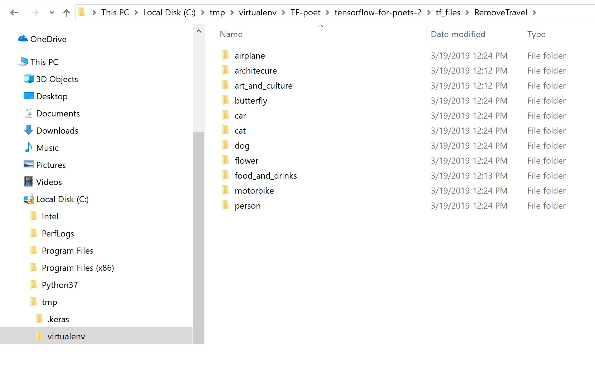  

 ## Train models
 We choose mobilenet_1.0_224 as the basic model for transfer learning  
 We use it in several applications, the results is quite good
 
 <pre>
 $ python -m scripts.retrain --bottleneck_dir=tf_files/bottlenecks --how_many_training_steps=1000 --model_dir=tf_files/models/ --summaries_dir=tf_files/training_summaries/mobilenet_1.0_224 --output_graph=tf_files/RemoveTravel_graph.pb --output_labels=tf_files/RemoveTravel_labels.txt --architecture=mobilenet_1.0_224 --image_dir=tf_files/RemoveTravel
 </pre>
 where
    
    --bottleneck_dir: the directory for bottleneck, details of bottlenect can be found in tutorial
    --how_many_training_steps: iteration for training
    --model_dir: model for training, we are using mobilenet_1.0_224, it will download automatically if it is not exist
    --summaries_dir: training summary
    --output_graph: trained tensoflow frozen.pb
    --output_labels: trained image classification lables
    --architecture: mobilenet_1.0_224
    --image_dir: dataset to be trained

The training time is about 10 minutes for the current traing, it depends on the time to proceeding dataset, i.e., the more dataset images the longer the training time.  
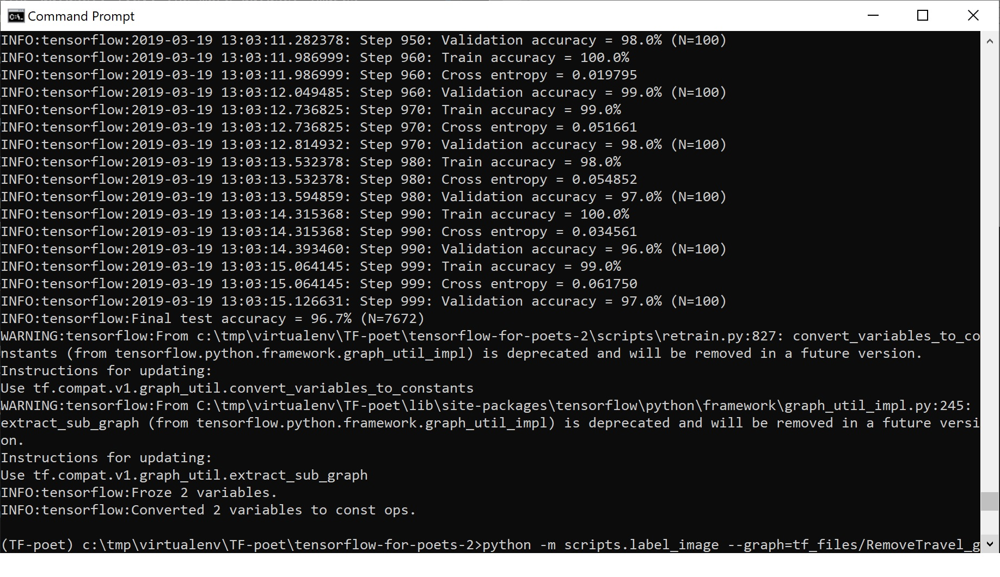  
After training process completed, 2 files will be created at C:\tmp\virtualenv\TF-poet\tensorflow-for-poets-2\tf_files
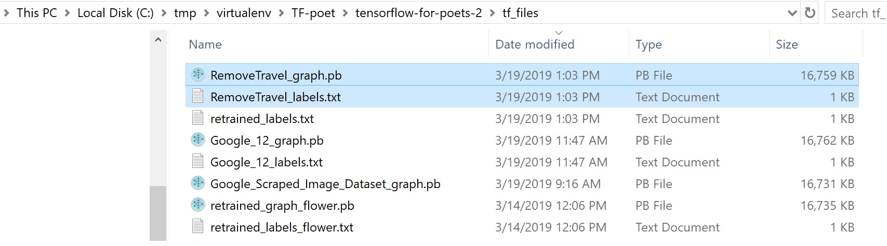  
We can test the inference via tensorflow via Python directly  
Note: you should rename RemoveTravel_labels.txt as retrained_labels.txt due to the the inference program seek for the fixed file name to be retrained_labels.txt
<pre>
 $ python -m scripts.label_image --graph=tf_files/RemoveTravel_graph.pb --image=C:\Users\arbula\Downloads\f1.jpg
 </pre>
 where
    
    --graph: the frozen pb we trained
    --image: the picture for inference

You should see the inference results like this     
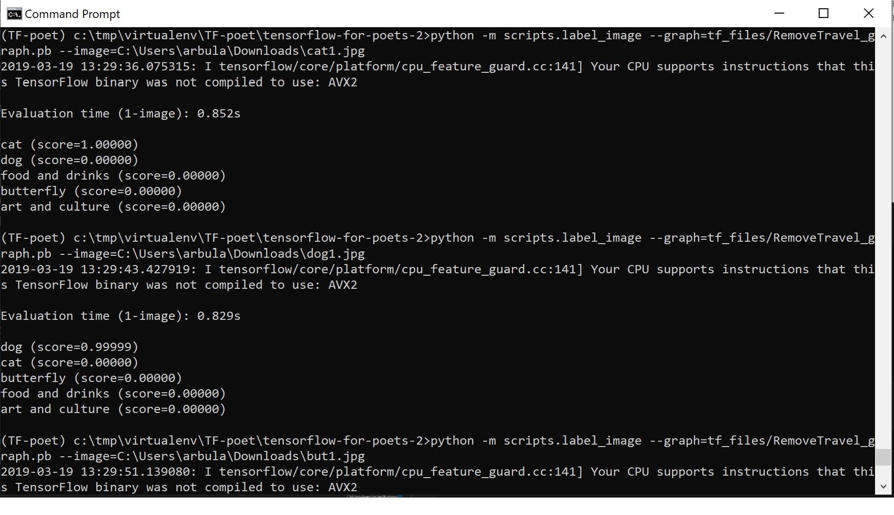  
 
## Covert to OpenVINO optimized Intermediate Representation (IR) 
At this step, we do the conversion from tensorflow frozen pb to OpenVINO optimized Intermediate Representation (IR), different mean and variance might need to be configured, plesae see <a href="https://software.intel.com/en-us/articles/OpenVINO-Using-TensorFlow#inpage-nav-2-1"> Supported Topologies</a> for more details. 
Due to we are applying mobilenet_1.0_224, therefore, <a href="https://software.intel.com/en-us/articles/OpenVINO-ModelOptimizer"> OpenVINO Model Optimizer</a> command will be 
<pre>
 Initialize the environment variables
 $ C:\Intel\computer_vision_sdk\bin\setupvars.bat
 
 Change to model optimizer directory
 $ cd C:\Intel\computer_vision_sdk\deployment_tools\model_optimizer

 For CPU GPU FP32
 $ python mo_tf.py --input_model C:\tmp\virtualenv\TF-poet\tensorflow-for-poets-2\tf_files\RemoveTravel_graph.pb --mean_values [127.5,127.5,127.5] --scale 127.5 --data_type FP32

 For NCS GPU FP16
$ python mo_tf.py --input_model C:\tmp\virtualenv\TF-poet\tensorflow-for-poets-2\tf_files\RemoveTravel_graph.pb --mean_values [255,255,255] --scale 255 --data_type FP16
 </pre>

 Note 1: data type FP32: --mean_values [127.5,127.5,127.5] --scale 127.5 is coming from <a href="https://software.intel.com/en-us/articles/OpenVINO-Using-TensorFlow#inpage-nav-2-1"> Supported Topologies</a>  
 Note 2: data type FP32: --mean_values [255,255,255] --scale 255 is coming from trial and error (actually only 1 trial with gut feeling)

You should see the model is coverted successfully

 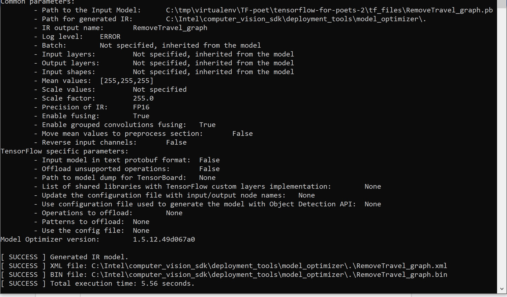  

And you can find 3 files is generated
* RemoveTravel_graph.xml
* RemoveTravel_graph.bin
* RemoveTravel_graph.mapping  

Please rename RemoveTravel_graph* manually as the data type (FP32 and FP16) you specified in the command

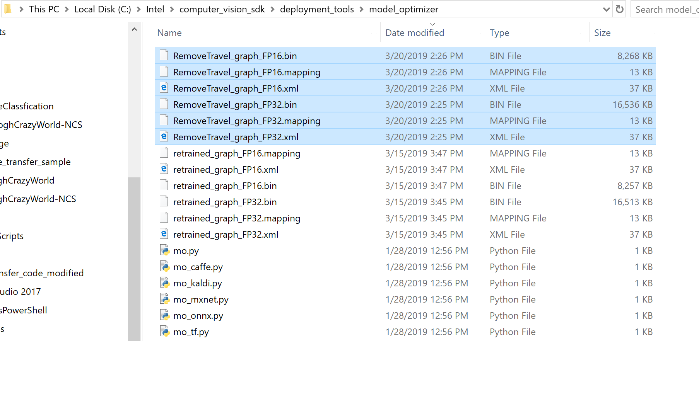  

## Inference on OpenVINO
Finally, we can run the inference via OpenVINO  
Please copy files to OpenVINO executable folder, C:\Users\arbula\Documents\Intel\OpenVINO\inference_engine_samples_2017\intel64\Release
* IR generated files with FP32 and FP16
* RemoveTravel_labels.txt that generated while in traing phase and rename as 2 files RemoveTravel_graph_FP32.labels and RemoveTravel_graph_FP16.labels

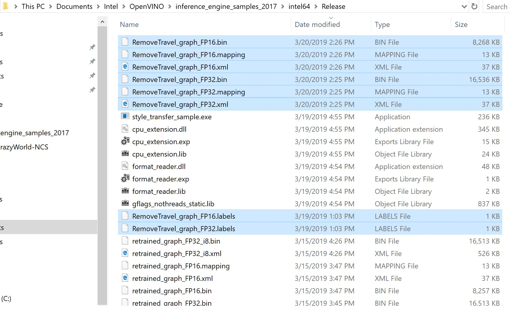  

Before running the inference on NCS2, be sure the NCS2 driver is well installed on <a href="https://software.intel.com/en-us/articles/OpenVINO-Install-Windows#inpage-nav-6-2"> Windows10</a> and <a href="https://software.intel.com/en-us/articles/OpenVINO-Install-Linux#inpage-nav-4-2"> Linux</a>  

With the command, we should see the inference
<pre>
 $ C:\Intel\computer_vision_sdk\bin\setupvars.bat
 $ cd C:\Users\arbula\Documents\Intel\OpenVINO\inference_engine_samples_2017\intel64\Release
 
 For FP32 CPU GPU 
 $ classification_sample.exe -i C:\Users\arbula\Downloads\dog1.jpg -m RemoveTravel_graph_FP32.xml

 $ classification_sample.exe -i C:\Users\arbula\Downloads\dog1.jpg -m RemoveTravel_graph_FP32.xml -d GPU

 For FP16 NSC GPU 
 $ classification_sample.exe -i C:\Users\arbula\Downloads\dog1.jpg -m RemoveTravel_graph_FP16.xml -d MYRIAD

 $ classification_sample.exe -i C:\Users\arbula\Downloads\dog1.jpg -m RemoveTravel_graph_FP16.xml -d GPU
 </pre>
 where

    -i: inference image path
    -m: models to be loading to plugin
    -d: devices, CPU (default), GPU, MYRIAD (NCS)

You should see the results
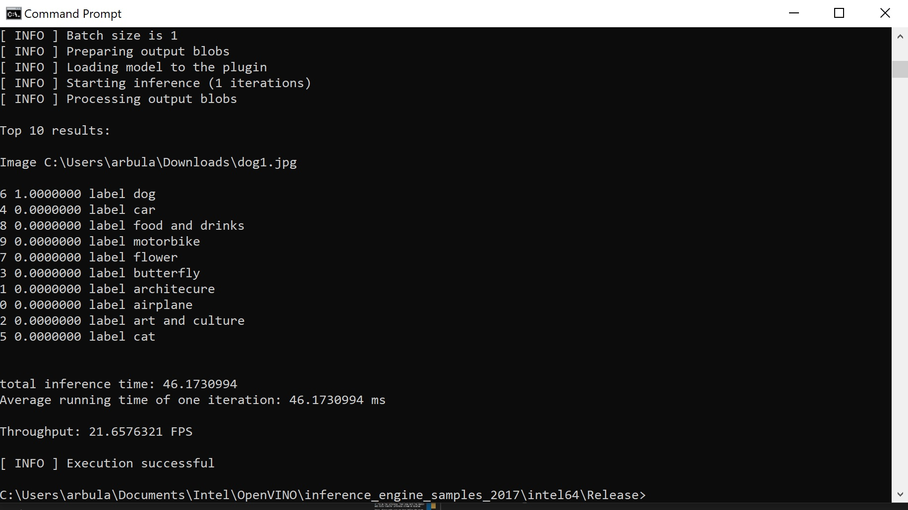  

## Calibration tool to convert FP32 to INT8
Inference Engine Calibration Tool calibrates a given FP32 model so that is can be run in low-precision 8-bit integer mode while keeping the input data of this model in the original precision.
Please refer to <a href="https://docs.openvinotoolkit.org/2018_R5/_samples_calibration_tool_README.html"> Calibration Tool </a> for details  

With the command, we can apply Intel calibration tool to produce FP32 model to INT8
<pre>
 $ C:\Intel\computer_vision_sdk\bin\setupvars.bat
 $ cd C:\Users\arbula\Documents\Intel\OpenVINO\inference_engine_samples_2017\intel64\Release
 $ calibration_tool.exe -t C -i C:\tmp\virtualenv\TF-poet\tensorflow-for-poets-2\tf_files\RemoveTravel -m RemoveTravel_graph_FP32.xml -lbl RemoveTravel_graph_FP32.labels
 </pre>
 It cost about 20 hours on Maldives Swift 7 for this model

 Finally, you will see the results

 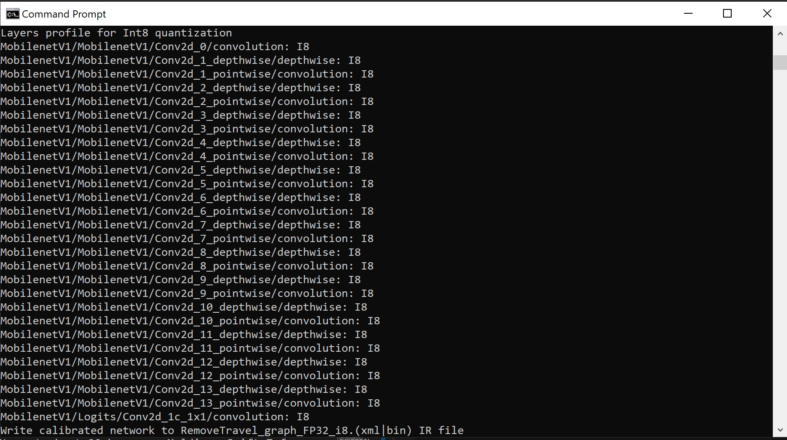  

and see IR files produced and located at C:\Users\arbula\Documents\Intel\OpenVINO\inference_engine_samples_2017\intel64\Release
 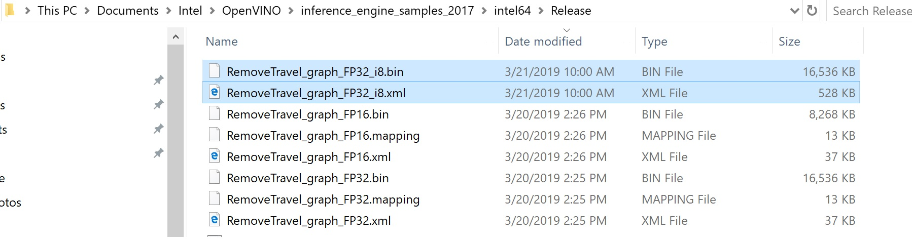  

In the end, copy labels file and rename as RemoveTravel_graph_FP32_i8.labels, do the inference
<pre>
 $ classification_sample.exe -i C:\Users\arbula\Downloads\dog1.jpg -m RemoveTravel_graph_FP32_i8.xml
 </pre>

 You will see the inference results as
  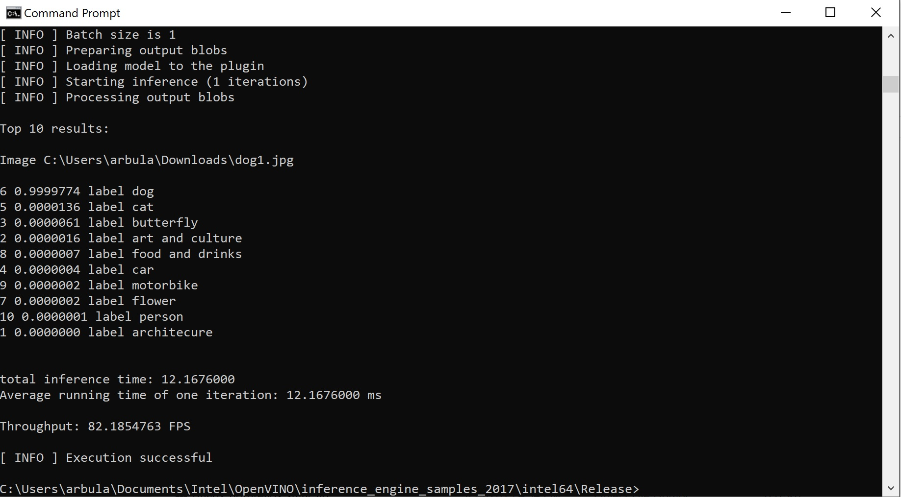  

## Credits 

<a href="https://software.intel.com/en-us/openvino-toolkit"> Intel® Distribution of OpenVINO™ toolkit</a>

## License

This project is licensed under the MIT, see the [LICENSE.md](LICENSE)
